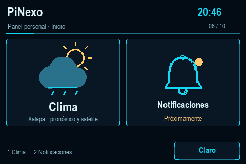
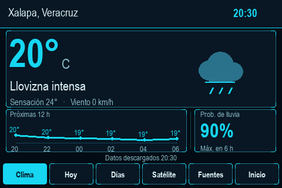
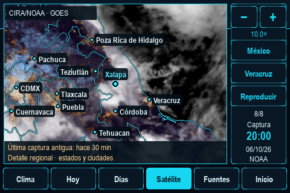

# PiNexo

Panel personal para una Raspberry Pi 3 y una pantalla GPIO de **480×320**. Un menú de iconos grandes abre el módulo del clima: pronóstico, avisos de lluvia e imágenes satelitales de México con ciudades y límites estatales. El modo oscuro utiliza fondos azules, líneas cian y detalles ámbar, con un modo claro alternativo.

El objetivo es dar un uso cotidiano a hardware disponible mediante una interfaz sencilla y módulos que puedan crecer después. **Notificaciones** aparece en el menú como «Próximamente»; todavía no conecta cuentas ni recibe mensajes.



## Funciones actuales

- Inicio con iconos de Clima y Notificaciones.
- Condiciones actuales, temperatura por hora, vista Hoy y próximos tres días.
- Aviso configurable de probabilidad de lluvia; no es una alerta oficial.
- Historial NOAA GeoColor con reproducción, pausa, arrastre y zoom de **1× a 10×**.
- Límites estatales y ciudades según el zoom, con Xalapa destacada.
- Recorte regional de la misma captura al ampliar más de 4× y pausar.
- Tema oscuro/claro persistente, caché local y descargas en segundo plano.
- Inicio automático opcional mediante un servicio del usuario.




## Requisitos

El equipo de referencia es una **Raspberry Pi 3**, Debian 13 de 64 bits y escritorio **labwc**, con un LCD GPIO de 3.5 pulgadas. La aplicación requiere **Python 3.10 o superior** y **Pygame**, una sesión gráfica y conexión a Internet para actualizar los datos. También puede previsualizarse en una ventana.

La pantalla debe funcionar en el escritorio antes de instalar el panel. La [guía de hardware](docs/hardware.md) describe el equipo y la configuración de referencia. El controlador táctil **sigue pendiente de calibración**; se puede utilizar ratón y teclado.

## Instalación

En la Raspberry instala Git y la dependencia gráfica disponible en Debian:

```bash
sudo apt update
sudo apt install git python3-pygame
```

Clona el repositorio y entra en su carpeta:

```bash
git clone https://github.com/EI-Flores/pinexo.git
cd pinexo
```

Crea la configuración a partir del ejemplo, conservando cualquier archivo que ya tengas:

```bash
test -f config.json || cp config.json.example config.json
```

Completa **config.json** con tu ciudad, latitud, longitud y zona horaria antes
de consultar el pronóstico. La plantilla contiene el nombre «Configura tu
ciudad», coordenadas **0, 0** y zona **UTC** como valores por sustituir; no
incluye una configuración personal. El encuadre satelital y la cartografía
actuales se concentran en México; cambiar la ciudad del pronóstico no cambia
esos encuadres.

Comprueba el pronóstico y ejecuta el panel:

```bash
python3 app.py --check-weather
python3 app.py
```

Si no tienes una pantalla de 480×320 o quieres previsualizarlo, usa **python3 app.py --windowed**. La opción **--demo** muestra datos meteorológicos inventados sin conexión:

```bash
python3 app.py --windowed --demo
```

Para iniciar automáticamente en la sesión de tu usuario, cierra primero cualquier instancia manual y ejecuta:

```bash
python3 manage.py enable
```

El servicio necesita que el escritorio del mismo usuario esté disponible. No inicia la sesión gráfica por su cuenta y no requiere ejecutar el panel como administrador.

## Uso y mantenimiento

| Acción | Control |
|---|---|
| Entrar al clima desde Inicio | Icono Clima o 1 |
| Volver a Inicio | Botón Inicio, H o Escape |
| Cambiar tema | Claro/Oscuro en Inicio o D |
| Elegir vista meteorológica | Botones inferiores o 1–5 |
| Reproducir/pausar satélite | Botón o Espacio/P |
| Zoom y desplazamiento | +/−, rueda y arrastre; flechas para mover |
| México / Veracruz | Botones o M / V |
| Cerrar | Escape desde Inicio |

Al pasar de **4×** se pausa la animación. El panel solicita un recorte regional cuando se estabiliza el encuadre; conserva la imagen disponible ante fallos y evita descargar un historial completo por cada aumento. La hora mostrada sigue siendo la de esa captura. **10× no añade detalle de calles**: la resolución depende del sensor y del producto.

La caché y la preferencia de tema se guardan en **~/.cache/pi-clima** o bajo **XDG_CACHE_HOME**. El nombre interno del servicio es **pi-clima.service**, conservado por compatibilidad. **PiNexo** es el nombre del proyecto; el nombre de red de la Raspberry se configura aparte.

Para consultar el servicio:

```bash
python3 manage.py status
python3 manage.py logs
```

Para desactivar el inicio automático, usa **python3 manage.py disable**. Después de cambiar config.json, reinícialo con **systemctl --user restart pi-clima.service**. Si ejecutas manualmente, detén antes el servicio para evitar dos instancias.

## Estado y documentación

La aplicación incorpora pruebas locales para datos, caché y controles, y vistas renderizadas con un controlador gráfico simulado. La fluidez, el consumo y el touch necesitan comprobarse en cada Raspberry y pantalla; no se presenta una certificación de compatibilidad con todos los LCD GPIO.

- [Arquitectura y flujo de datos](docs/architecture.md).
- [Hardware y pantalla de referencia](docs/hardware.md).
- [Mejoras consideradas](docs/roadmap.md).
- [Fuentes y atribuciones](docs/data-sources.md).
- [Actualizar una instalación existente](docs/upgrade.md).
- [Cómo contribuir](CONTRIBUTING.md) y [pruebas sin conexión](tests/README.md).

Para comprobar el software en un entorno de desarrollo con Python 3.12:

```sh
python -m pip install -r requirements-dev.txt
python -m unittest discover -s tests -t . -v
```

GitHub Actions ejecuta estas pruebas con pantalla simulada. No comprueba el
cableado, el controlador ni la fluidez del LCD físico.

## Autoría y fuentes

Proyecto de [EI-Flores](https://github.com/EI-Flores). Los datos externos conservan sus atribuciones y condiciones de uso:

- [Open-Meteo](https://open-meteo.com/en/docs): pronóstico; [licencia y atribución](https://open-meteo.com/en/licence), [CC BY 4.0](https://creativecommons.org/licenses/by/4.0/).
- [NOAA GeoColor](https://satellitemaps.nesdis.noaa.gov/arcgis/rest/services/ABIGC_Last_24hr/ImageServer): imágenes satelitales; crédito CIRA/NOAA.
- [Natural Earth](https://www.naturalearthdata.com/): límites y ciudades, [dominio público](https://www.naturalearthdata.com/about/terms-of-use/). Créditos y originales en map_data.json.
- [GeoNames: Xalapa](https://www.geonames.org/3526617/xalapa-de-enriquez.html): coordenadas, [CC BY](https://www.geonames.org/export/#terms).

El código se distribuye con [licencia MIT](LICENSE), con autoría **EI-Flores**.
Los datos e imágenes externos conservan sus propias condiciones, descritas en
[Fuentes y atribuciones](docs/data-sources.md).

La ficha del proyecto en GitHub Pages se preparará después.
