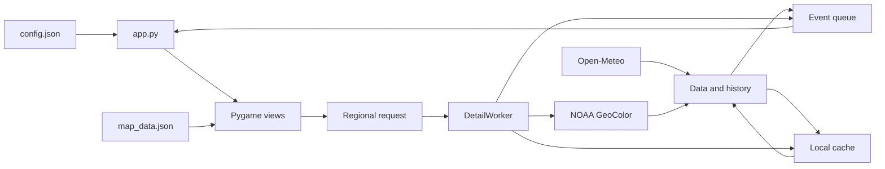

# PiNexo architecture

PiNexo is a **Python/Pygame** desktop application with a fixed **480×320** canvas. The current version provides a Home menu and a weather module. Downloads run separately from rendering so controls remain available while data arrives.

## Modules

| File | Responsibility |
|---|---|
| `app.py` | Configuration, graphical session, event loop, navigation, and worker coordination. |
| `home_ui.py` | Home icons and the placeholder Notifications page. |
| `ui.py`, `forecast_ui.py` | Weather views, loading states, notices, and sources. |
| `forecast_helpers.py` | Daily data, hourly intervals, and rain notice calculations. |
| `satellite_ui.py` | Playback, zoom, panning, detail requests, and satellite rendering. |
| `theme.py`, `preferences.py` | Dark/light palettes, frames, and theme persistence. |
| `data.py` | Forecasts, HTTP downloads, validation, and shared cache handling. |
| `geo_satellite.py` | NOAA catalog and historical frames with geographic extents. |
| `satellite_data.py` | Earlier JPEG history, used when the geographic source is disabled. |
| `satellite_detail.py` | Regional crops of a specific observation and their cache. |
| `detail_worker.py` | A detail worker with one replaceable pending request. |
| `geography.py`, `map_data.json` | Boundary and city projection, label selection, and attribution. |
| `manage.py` | User service installation and inspection. |

The current interface does not require a GIS library or a web server. Pygame draws shapes, text, and images; downloads and configuration loading use the Python standard library.

## Data flow

On startup, the application loads valid cached data and starts a download worker for weather and satellite history. Results arrive as events in a queue. The interface thread opens images and updates Pygame surfaces; workers do not render.

The default configuration refreshes weather every **15 minutes** and satellite history every **10 minutes**. Errors produce messages and spaced retries, preserving previous data or frames when they remain valid. Retrieval time is distinguished from the satellite observation time.

## Navigation and rendering

The application starts on **Home** (`Inicio`). Weather (`Clima`) opens the current conditions, Today (`Hoy`), Days (`Días`), Satellite (`Satélite`), and Sources (`Fuentes`) views. Notifications (`Notificaciones`) shows a placeholder page with no external integration. H or Escape returns to Home; Escape from Home exits the application.

Weather views can rotate according to `page_seconds`. Home, Notifications, and Sources remain open until the next action. Paused satellite playback also holds the view so the selected area can be inspected. Rendering updates when data, the page, the clock, or animation changes.

All views share the theme. Changing it preserves navigation, playback, and zoom state; the preference is written to `preferences.json` outside the source tree. Demo mode does not save that preference or start downloads.

## Satellite imagery and regional detail

Geographic frames contain an image, identifier, observation time, and extent in WGS84 coordinates. Map features are projected over that extent. Labels are prioritized according to zoom and available space to reduce overlap.

Zoom is limited to **1×–10×**. Crossing **4×** pauses playback. Once the view settles, it can request a regional crop of the same observation from NOAA. A token identifies the request so a response for an earlier view is not applied.

`DetailWorker` keeps at most one download in progress and the latest pending request. `satellite_detail` bounds the requested size, validates responses, and uses its cache. Failures preserve the available image, and retries are spaced apart. New regional crops are not requested during playback. Zooming preserves the observation time and cannot create resolution beyond that of the original product.

If an external static image is configured or `satellite_geography` is disabled, the application does not overlay map features on an image without known coordinates or request a geographic crop.

## Configuration, cache, and service

`config.json` contains the location, time zone, intervals, and options. The repository provides `config.json.example`; local configuration does not need to be committed to version control.

The cache lives in `~/.cache/pi-clima` or under the directory specified by `XDG_CACHE_HOME`. Writes use temporary files and atomic replacement. Reads validate structure, provenance, and size before reusing data.

`manage.py` generates `pi-clima.service` in the user's systemd configuration. It runs `app.py` with `--service`, which looks for a single labwc session owned by the same user. The service restarts after failures and preserves the existing internal names to simplify upgrades. It does not enable automatic login or change touchscreen configuration.

## Current limitations

The interface is tailored to a 480×320 LCD, and the current map views focus on Mexico. The architecture separates views and data but does not yet provide a plugin system. Touch input requires calibration on the device, and Notifications does not implement authentication or account connections. Performance and resource use need measuring on the Raspberry Pi that will run the application.
