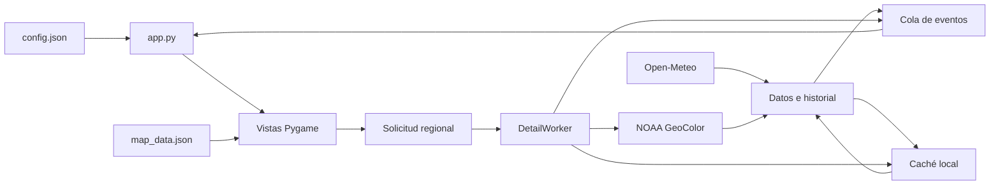

# Arquitectura de PiNexo

PiNexo es una aplicación de escritorio **Python/Pygame** con un lienzo fijo de **480×320**. La versión actual utiliza un menú principal y un módulo meteorológico, con las descargas separadas del dibujo para mantener los controles disponibles mientras llega información.

## Módulos

| Archivo | Responsabilidad |
|---|---|
| app.py | Configuración, sesión gráfica, bucle de eventos, navegación y coordinación de trabajadores. |
| home_ui.py | Inicio con iconos y página de Notificaciones pendiente. |
| ui.py, forecast_ui.py | Vistas meteorológicas, estados de carga, avisos y fuentes. |
| forecast_helpers.py | Datos diarios, intervalos horarios y cálculo de avisos de lluvia. |
| satellite_ui.py | Reproducción, zoom, desplazamiento, solicitudes de detalle y dibujo satelital. |
| theme.py, preferences.py | Paletas oscuro/claro, marcos y persistencia del tema. |
| data.py | Pronóstico, descarga HTTP, validación y caché común. |
| geo_satellite.py | Catálogo y cuadros históricos NOAA con extensión geográfica. |
| satellite_data.py | Historial JPEG anterior, utilizado cuando no se activa la fuente geográfica. |
| satellite_detail.py | Recortes regionales de una captura concreta y su caché. |
| detail_worker.py | Un trabajador de detalle, con una solicitud pendiente reemplazable. |
| geography.py, map_data.json | Proyección de límites y ciudades, selección de etiquetas y atribuciones. |
| manage.py | Instalación y consulta del servicio del usuario. |

No se requiere una biblioteca GIS ni un servidor web para la interfaz actual. Pygame dibuja formas, texto e imágenes; la descarga y la lectura de configuración utilizan la biblioteca estándar de Python.

## Flujo de datos

Al iniciar se leen datos válidos de caché y se arranca un trabajador de descarga para el clima y el historial. Los resultados llegan como eventos a una cola. El hilo de la interfaz abre las imágenes y modifica las superficies Pygame; los trabajadores no dibujan.

La configuración predeterminada consulta el clima cada **15 minutos** y el historial cada **10 minutos**. Los errores producen mensajes y reintentos espaciados, conservando los datos o cuadros anteriores cuando siguen siendo válidos. La hora de consulta se distingue de la hora de captura satelital.

## Navegación y dibujo

La aplicación inicia en **Inicio**. Clima abre las vistas actuales, Hoy, Días, Satélite y Fuentes. Notificaciones muestra una página pendiente, sin integración externa. H o Escape vuelve al menú; Escape desde Inicio termina la aplicación.

Las vistas meteorológicas pueden alternarse según **page_seconds**. Inicio, Notificaciones y Fuentes permanecen abiertas hasta la siguiente acción. El satélite pausado también permanece para permitir inspeccionar el encuadre. El dibujo se actualiza cuando cambian los datos, la página, el reloj o la animación.

El tema se comparte entre todas las vistas. Cambiarlo conserva el estado de navegación, reproducción y zoom; la preferencia se escribe en preferences.json fuera del código. El modo de demostración no guarda esa preferencia ni inicia descargas.

## Satélite y detalle regional

Los cuadros geográficos contienen imagen, identificador, hora de captura y extensión en coordenadas WGS84. La cartografía se proyecta sobre esa extensión. Los nombres se priorizan según el zoom y el espacio disponible para reducir superposiciones.

El zoom está limitado a **1×–10×**. Al cruzar **4×**, se pausa la reproducción. Después de estabilizar el encuadre, la vista puede pedir un recorte regional de la misma captura a NOAA. La petición está identificada con un token para evitar aplicar una respuesta perteneciente a un encuadre anterior.

DetailWorker conserva como máximo una descarga en curso y la última solicitud pendiente. satellite_detail limita el tamaño solicitado, valida la respuesta y utiliza su caché. Un fallo conserva la imagen disponible; los reintentos se espacian. Durante reproducción no se solicitan nuevos recortes regionales. Ampliar conserva la hora de observación y no crea resolución superior a la del producto original.

Si se configura una imagen estática externa o se desactiva **satellite_geography**, no se dibuja cartografía sobre una imagen sin coordenadas conocidas ni se solicita el recorte geográfico.

## Configuración, caché y servicio

**config.json** contiene ubicación, zona horaria, intervalos y opciones. El repositorio distribuye **config.json.example**; la configuración local no necesita formar parte del control de versiones.

La caché reside en **~/.cache/pi-clima** o en el directorio indicado por **XDG_CACHE_HOME**. Las escrituras utilizan archivos temporales y reemplazo atómico. Las lecturas validan estructura, procedencia y tamaño antes de reutilizar datos.

manage.py genera **pi-clima.service** en la configuración systemd del usuario. Ejecuta app.py con **--service**, que busca una única sesión labwc perteneciente al mismo usuario. El servicio reinicia ante fallos y conserva los nombres internos existentes para facilitar actualizaciones. No habilita inicio de sesión automático ni cambia la configuración del touch.

## Límites actuales

La interfaz está ajustada al LCD de 480×320, y los encuadres cartográficos actuales se concentran en México. La arquitectura separa vistas y datos, pero todavía no ofrece un sistema de plugins. El touch requiere calibración en el equipo; Notificaciones no incorpora autenticación ni cuentas. La fluidez y el consumo deben medirse en la Raspberry que se vaya a utilizar.
